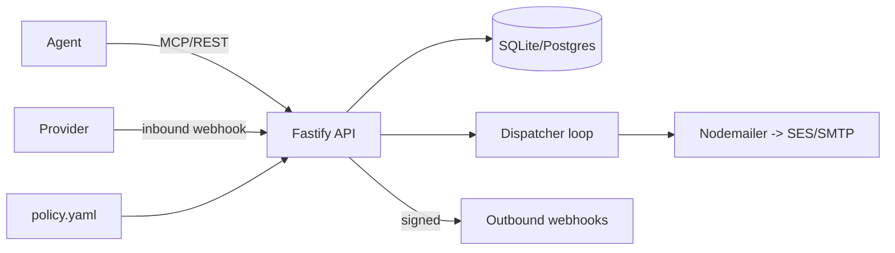

# Spec 01 — Agent Mailbox

> Inherits everything in `00-spec-conventions.md`. Slug: `agent-mailbox`. Stack: TypeScript/Node 22.

---

## Section 1 — Product definition & competitive wedge

- **One-line pitch:** Every agent gets its own inbox. You keep the veto.
- **Description:** Agent Mailbox is a self-hosted email server for AI agents. It provisions real,
  addressable inboxes (`agent-name@yourdomain`), parses inbound mail into structured JSON, and sends
  outbound mail through a bring-your-own SMTP/SES provider — but every external send passes through a
  policy engine and an optional human approval queue. It exposes REST, an MCP server, and webhooks so
  any agent framework can read, send, and react to email with full audit trail and human oversight.
- **Target user:** developers building agents that must send/receive email (support, ops, outreach,
  bookkeeping, scheduling) who want control of credentials, data, and outbound behavior.
- **Wedge vs. competitors:** AgentMail, Dead Simple Email, Inbound, Nylas Agent Accounts, and Atomic
  Mail are all **hosted**. Our research found **zero self-hosted open-source agent-inbox servers**.
  Wedge = self-hosted + policy/approval governance layer (send allowlists, spend/volume caps, "human
  must approve external sends") that hosted providers do not offer. We do not compete on deliverability
  (BYO SES/SMTP); we compete on control + oversight + data locality.
- **Dataset evidence:** Email is the highest-engagement mainstream topic in the PH dataset (median 236
  upvotes vs 140 overall). Upstream ("The inbox designed for humans and agents") won day and week at
  653 upvotes / 243 comments. Atomic Mail Agentic (257u) launched agent inboxes in-window. Slashy
  (462u) and Receiptor Agent Mode (483u) confirm agent+email demand.

---

## Section 2 — v1 scope & non-goals

**Features (each with acceptance criteria):**

1. **Inbox provisioning**
   - Given a running server and a configured domain, When a client calls `POST /inboxes` with a name,
     Then a new inbox `name@domain` is created, persisted, and returned with an `inbox_id`.
2. **Inbound receive & parse**
   - Given an inbox exists, When mail arrives (via SMTP listener or provider inbound webhook), Then the
     raw MIME is parsed into structured JSON (from/to/subject/text/html/attachments/headers), stored,
     threaded by `Message-ID`/`In-Reply-To`, and an outbound webhook fires.
3. **Outbound send with policy**
   - Given an inbox and a policy file, When a client calls `POST /inboxes/:id/messages`, Then the send
     is evaluated against policy (allowlist, per-window caps, external-domain rule); allowed sends are
     dispatched via the configured provider; blocked sends return `403` with the rule that blocked them;
     approval-required sends are queued as `pending` and return `202`.
4. **Human approval queue**
   - Given a pending send, When an operator calls `POST /approvals/:id/approve` (or `/deny`), Then the
     message is dispatched (or dropped), and the decision is recorded with actor + timestamp.
5. **Threading & retrieval**
   - Given stored messages, When a client calls `GET /inboxes/:id/threads` or `GET /messages/:id`, Then
     ordered threads / a single message are returned with pagination.
6. **MCP surface** — the above exposed as MCP tools for agents.
7. **Audit log** — every provision/send/receive/approval is an append-only audit row, queryable.

**Non-goals (v1 must NOT):**
- Not a deliverability/warmup product (no IP warmup, no reputation monitoring).
- No webmail UI beyond a minimal read-only approval console page.
- No IMAP client to read a human's existing Gmail/Outlook (that is Nylas' space).
- No multi-org SaaS billing, no user accounts beyond a single shared API key + operator token.
- No spam filtering ML; only basic allow/deny + optional SpamAssassin passthrough hook.

---

## Section 3 — Customer personas & all interaction flows

**Personas:**
- **Dev Dana** — building a support agent; wants agents to answer email but never send refunds copy
  without review. Runs the server via Docker on a VPS.
- **Operator Omar** — non-technical teammate who approves/denies flagged outbound mail from a web page.
- **Agent (machine)** — an LLM agent calling the MCP tools.

**Flows:**

- **F0 — Install / first run**
  1. User runs `docker compose up` (or `npx agent-mailbox init && agent-mailbox serve`).
  2. Server detects no config, writes `agent-mailbox.config.yaml` with commented defaults, creates
     `./data/agent-mailbox.db`, generates and prints an API key + operator token once.
  3. Prints: DB path, config path, listening URL, and "next: set MAILBOX_DOMAIN and a provider".
  4. `GET /healthz` returns ok. Exit criteria: server up on default port with zero prior config.

- **F1 — Provision an inbox (Dana / agent)**
  1. `POST /inboxes {"name":"support"}` → `201 {inbox_id, address:"support@domain"}`.
  2. Audit row `inbox.created` written.

- **F2 — Receive inbound mail**
  1. Provider posts inbound webhook (or SMTP listener receives) → server verifies signature.
  2. MIME parsed → message stored → thread resolved → `message.received` webhook emitted to Dana's app.
  3. Agent later calls MCP `list_messages` to read it.

- **F3 — Agent sends a reply (allowed)**
  1. Agent calls MCP `send_message` with `inbox_id`, `to`, `subject`, `body`, `in_reply_to`.
  2. Policy passes (recipient on allowlist, under cap) → dispatched via provider → `202 {message_id,
     status:"sent"}` → `message.sent` webhook.

- **F4 — Agent sends, approval required (Omar)**
  1. Agent `send_message` to an external domain flagged `require_approval`.
  2. Server queues `pending`, returns `202 {status:"pending_approval", approval_id}`, emits
     `approval.requested` webhook.
  3. Omar opens `/console/approvals`, sees the drafted email, clicks Approve.
  4. `POST /approvals/:id/approve` → message dispatched → `message.sent` + `approval.decided` webhooks.

- **F5 — Send blocked by policy**
  1. Agent `send_message` to a domain on the blocklist / over the daily cap.
  2. Server returns `403 {error:"policy_blocked", rule:"blocklist:competitor.com"}`; nothing sent;
     audit `send.blocked` written.

- **Edge flows:**
  - **Empty state:** `GET /inboxes` on fresh install returns `[]` with `200`, not an error.
  - **Large attachment:** inbound >25MB → stored to blob path, metadata in DB, not inlined in webhook.
  - **Concurrent sends:** per-inbox cap enforced atomically (DB transaction) under parallel calls.
  - **Offline provider:** send fails → message marked `failed`, retried with backoff, surfaced in audit.

- **Error / recovery flows:**
  - **Bad API key:** any API call → `401 {error:"unauthorized"}`.
  - **Malformed send body:** `400` with Zod validation detail.
  - **Provider auth failure:** `502 {error:"provider_error"}`, message `failed`, not lost; operator can
    retry via `POST /messages/:id/retry`.
  - **Interrupted server during send:** on restart, messages in `sending` state >5min are re-queued.

- **Config / policy change flow:** edit `policy.yaml` → `POST /policy/reload` (or SIGHUP) → validated;
  invalid policy is rejected and the old policy stays active with an error logged.

- **Upgrade flow:** `docker compose pull && up` → migrations run automatically on boot (idempotent),
  version logged; `GET /healthz` returns new version.

- **Uninstall / export flow:** `agent-mailbox export --out dump.json` writes all inboxes/messages/audit
  as JSON; deleting `./data` removes everything. Documented in README.

---

## Section 4 — Golden-path terminal transcripts

**T1 — First run**
```
$ docker compose up -d
$ curl -s localhost:8081/healthz
{"status":"ok","version":"0.1.0"}
$ docker compose logs --no-log-prefix app | head -4
[agent-mailbox] no config found; wrote agent-mailbox.config.yaml (defaults)
[agent-mailbox] created ./data/agent-mailbox.db
[agent-mailbox] API key: amb_live_9f2c... (shown once)  operator token: op_7b1a... (shown once)
[agent-mailbox] listening on http://0.0.0.0:8081  — set MAILBOX_DOMAIN to send/receive
```

**T2 — Provision + send (allowed)**
```
$ export K=amb_live_9f2c...
$ curl -s -XPOST localhost:8081/inboxes -H "authorization: Bearer $K" \
    -H 'content-type: application/json' -d '{"name":"support"}'
{"inbox_id":"018f...","address":"support@example.com","created_at":"2026-07-07T12:00:00Z"}

$ curl -s -XPOST localhost:8081/inboxes/018f.../messages -H "authorization: Bearer $K" \
    -H 'content-type: application/json' \
    -d '{"to":"customer@allowed.com","subject":"Re: order","body":"On its way."}'
{"message_id":"019a...","status":"sent"}
```

**T3 — Send requiring approval, then approve**
```
$ curl -s -XPOST localhost:8081/inboxes/018f.../messages -H "authorization: Bearer $K" \
    -d '{"to":"press@external.com","subject":"Statement","body":"..."}' -H 'content-type: application/json'
{"message_id":"019b...","status":"pending_approval","approval_id":"02aa..."}

$ curl -s -XPOST localhost:8081/approvals/02aa.../approve -H "authorization: Bearer op_7b1a..."
{"approval_id":"02aa...","decision":"approved","message_status":"sent"}
```

**T4 — Blocked (failure transcript, non-zero exit via CLI)**
```
$ agent-mailbox send --inbox support --to sales@competitor.com --subject hi --body hi
error: policy_blocked (rule: blocklist:competitor.com)
$ echo $?
3
```

---

## Section 5 — Complete API surface

### 5a REST/HTTP endpoints (Fastify, base `/`, auth = `Authorization: Bearer <api_key>`; operator
endpoints require the operator token)

| Method | Path | Auth | Purpose |
|---|---|---|---|
| GET | `/healthz` | none | liveness → `{status,version}` |
| GET | `/readyz` | none | DB reachable check |
| POST | `/inboxes` | api | create inbox `{name}` → `{inbox_id,address,created_at}` |
| GET | `/inboxes` | api | list inboxes (paginated) |
| GET | `/inboxes/:id` | api | get inbox |
| DELETE | `/inboxes/:id` | api | soft-delete inbox |
| POST | `/inboxes/:id/messages` | api | send `{to,cc?,subject,body,html?,in_reply_to?,attachments?}` |
| GET | `/inboxes/:id/threads` | api | list threads (paginated) |
| GET | `/threads/:id` | api | thread with ordered messages |
| GET | `/messages/:id` | api | single message (full JSON) |
| POST | `/messages/:id/retry` | api | retry a `failed` send |
| POST | `/inbound` | signature | provider inbound webhook receiver |
| GET | `/approvals` | operator | list pending approvals |
| POST | `/approvals/:id/approve` | operator | approve → dispatch |
| POST | `/approvals/:id/deny` | operator | deny → drop |
| POST | `/policy/reload` | operator | revalidate + hot-reload policy |
| GET | `/audit` | api | query audit log (filter by type, inbox, since; paginated) |
| GET | `/console/approvals` | operator (cookie) | minimal read-only approval HTML page |

Request/response bodies are Zod schemas (see repo `src/schemas.ts`). Example send request schema:
```ts
z.object({ to: z.string().email(), cc: z.array(z.string().email()).optional(),
  subject: z.string().min(1).max(998), body: z.string(), html: z.string().optional(),
  in_reply_to: z.string().optional(),
  attachments: z.array(z.object({ filename: z.string(), content_base64: z.string(),
    content_type: z.string() })).optional() })
```
Pagination: `?limit=50&cursor=<uuid>` → `{items,next_cursor}`. Default limit 50, max 200.

### 5b CLI commands (`agent-mailbox`)
```
agent-mailbox init                 # write default config + db, print keys
agent-mailbox serve [--port] [--config]   # start server
agent-mailbox send --inbox <name|id> --to <addr> --subject <s> --body <b> [--html <f>]
agent-mailbox inboxes [--json]     # list
agent-mailbox approvals            # list pending (operator token from env)
agent-mailbox approve <approval_id> | deny <approval_id>
agent-mailbox export --out <file>  # dump all data as JSON
agent-mailbox migrate              # run migrations manually
```
Exit codes: `0` ok, `1` generic, `2` bad usage/validation, `3` policy_blocked, `4` unauthorized,
`5` provider_error.

### 5c MCP tools (stdio + streamable HTTP)
- `create_inbox({name}) -> {inbox_id,address}`
- `list_inboxes() -> [{inbox_id,address}]`
- `list_messages({inbox_id, thread_id?, limit?}) -> [message]`
- `get_message({message_id}) -> message`
- `send_message({inbox_id,to,subject,body,html?,in_reply_to?}) -> {message_id,status,approval_id?}`
- `list_pending_approvals() -> [approval]` (operator-scoped key)

### 5d Webhooks
- **Inbound (received by us):** `POST /inbound` from provider; verify HMAC signature header
  `X-Provider-Signature` against `PROVIDER_WEBHOOK_SECRET`. Reject `401` on mismatch.
- **Outbound (emitted by us)** to `webhook_url` in config, signed `X-AgentMailbox-Signature`
  (HMAC-SHA256 of body with `WEBHOOK_SIGNING_SECRET`): events `message.received`, `message.sent`,
  `message.failed`, `approval.requested`, `approval.decided`. Retry 5x exponential backoff; dead-letter
  to `audit` after final failure.

### 5e SDK
Published `@agent-mailbox/client` (TS): `new AgentMailbox({baseUrl, apiKey})` with methods mirroring 5a.

### 5f Error taxonomy (shared)
| code | http | exit | meaning | remediation |
|---|---|---|---|---|
| `unauthorized` | 401 | 4 | bad/missing key | check `Authorization` |
| `not_found` | 404 | 1 | inbox/message missing | verify id |
| `validation_error` | 400 | 2 | body failed schema | see `detail[]` |
| `policy_blocked` | 403 | 3 | send blocked by rule | see `rule`; adjust policy |
| `provider_error` | 502 | 5 | SMTP/SES failed | check provider creds; retry |
| `rate_limited` | 429 | 1 | over cap | wait / raise cap |
| `conflict` | 409 | 1 | duplicate inbox name | pick another name |

---

## Section 6 — Architecture & pinned stack

- **Runtime:** Node 22 LTS, TypeScript 5.6 (strict). **HTTP:** Fastify 5. **Validation:** Zod 3.
  **ORM/migrations:** Drizzle ORM + drizzle-kit (SQLite default, Postgres via `DATABASE_URL`).
  **Mail parse:** `mailparser` 3. **SMTP send:** `nodemailer` 6 (SMTP + SES transport). **SMTP
  receive (optional listener):** `smtp-server` 3. **MCP:** `@modelcontextprotocol/sdk`. **Test:**
  Vitest 2. **Build:** tsup. **PM:** pnpm.
- **Process model:** single Node process; Fastify HTTP + optional SMTP listener + a background
  dispatcher (in-process queue polling `messages` table for `queued`/`sending`).

- Rationale: Fastify+Zod gives typed contracts cheaply; Drizzle keeps one schema across SQLite/PG;
  BYO nodemailer transport is the deliverability wedge (no vendor lock).

---

## Section 7 — Data model

```sql
CREATE TABLE inboxes (
  id TEXT PRIMARY KEY, name TEXT NOT NULL, address TEXT NOT NULL UNIQUE,
  created_at TEXT NOT NULL, deleted_at TEXT);
CREATE TABLE threads (
  id TEXT PRIMARY KEY, inbox_id TEXT NOT NULL REFERENCES inboxes(id),
  subject TEXT, root_message_id TEXT, updated_at TEXT NOT NULL);
CREATE TABLE messages (
  id TEXT PRIMARY KEY, inbox_id TEXT NOT NULL REFERENCES inboxes(id),
  thread_id TEXT REFERENCES threads(id), direction TEXT NOT NULL, -- inbound|outbound
  status TEXT NOT NULL, -- received|queued|sending|sent|failed|pending_approval|denied
  mail_from TEXT, mail_to TEXT NOT NULL, cc TEXT, subject TEXT,
  text_body TEXT, html_body TEXT, headers_json TEXT, message_id_header TEXT,
  in_reply_to TEXT, error TEXT, created_at TEXT NOT NULL, updated_at TEXT NOT NULL);
CREATE TABLE attachments (
  id TEXT PRIMARY KEY, message_id TEXT NOT NULL REFERENCES messages(id),
  filename TEXT, content_type TEXT, size_bytes INTEGER, blob_path TEXT NOT NULL);
CREATE TABLE approvals (
  id TEXT PRIMARY KEY, message_id TEXT NOT NULL REFERENCES messages(id),
  status TEXT NOT NULL, -- pending|approved|denied
  rule TEXT, decided_by TEXT, decided_at TEXT, created_at TEXT NOT NULL);
CREATE TABLE audit (
  id TEXT PRIMARY KEY, type TEXT NOT NULL, inbox_id TEXT, message_id TEXT,
  actor TEXT, detail_json TEXT, created_at TEXT NOT NULL);
CREATE INDEX idx_messages_inbox ON messages(inbox_id, created_at);
CREATE INDEX idx_audit_type ON audit(type, created_at);
```
- Attachments stored on disk at `./data/blobs/<message_id>/<filename>`; Postgres delta: `blob_path`
  may point to S3 if `BLOB_S3_URL` set (optional).
- Migrations: drizzle-kit generates `drizzle/NNNN_*.sql`, applied on boot in a transaction; version
  tracked in `__migrations` table.

---

## Section 8 — Config & policy file schemas

`agent-mailbox.config.yaml`:
```yaml
port: 8081
domain: example.com               # MAILBOX_DOMAIN overrides
database_url: file:./data/agent-mailbox.db
provider:
  type: smtp                      # smtp | ses
  smtp: { host: "", port: 587, user: "", pass_env: SMTP_PASS }
webhook_url: ""                   # outbound events target (optional)
smtp_listener: { enabled: false, port: 2525 }
policy_file: ./policy.yaml
```

`policy.yaml`:
```yaml
default_action: allow             # allow | require_approval | block
allowlist_domains: [allowed.com]
blocklist_domains: [competitor.com]
require_approval_for:
  external_domains: true          # any recipient not in allowlist_domains
  contains_keywords: [refund, pricing, legal]
caps:
  per_inbox_per_day: 200
  per_inbox_per_hour: 50
```
**Invalid example + required error:**
```yaml
caps: { per_inbox_per_day: -5 }
```
→ startup/reload fails with: `policy invalid: caps.per_inbox_per_day must be a positive integer`
(exit 2 on CLI validate; `400` on `/policy/reload`). Precedence: blocklist > require_approval >
allowlist > default_action.

---

## Section 9 — Security & threat model

- **Secrets:** API key, operator token, provider password, webhook secrets from env / `.env`
  (git-ignored). Keys hashed (argon2id) at rest; shown once at creation. Never logged (redaction test).
- **AuthN/Z:** two scopes — `api` (agent operations) and `operator` (approvals, policy). Bearer tokens,
  constant-time compare.
- **Threats:**
  1. *Inbound webhook forgery* → mitigation: HMAC signature verify on `/inbound`; reject unsigned.
  2. *Outbound send abuse / data exfil by a compromised agent* → mitigation: policy engine caps +
     approval queue + blocklist; every send audited.
  3. *SSRF via `webhook_url`* → mitigation: block private IP ranges / metadata endpoints; allow only
     http(s); configurable allowlist.
  4. *Attachment path traversal* → sanitize filenames; store under message-id dir; never use client path.
- **Never logged:** raw credentials, full API keys, message bodies at info level (only at debug with
  explicit opt-in), attachment contents.

---

## Section 10 — Test plan & hard gates

- **Unit:** Zod schemas, policy evaluator (allow/block/approval/caps matrix), signature verify,
  filename sanitizer, redaction.
- **Integration:** REST endpoints against an in-memory SQLite; nodemailer mocked transport; inbound
  webhook parse→store→thread; approval flow; retry/backoff; migration idempotency.
- **E2E:** spin server via testcontainers or child process; reproduce transcripts T1-T4 exactly
  (assert stdout/JSON/exit codes).
- **Litmus suite:** `examples/litmus/` — 40 policy scenarios across 8 recipient/keyword/cap categories
  (mirrors open-agentops style): each a YAML `{send, policy, expect: allow|approval|block, rule?}`. A
  test iterates all 40 and asserts the evaluator matches `expect`.
- **Gate commands:** `pnpm i`, `pnpm lint`, `pnpm typecheck`, `pnpm test:unit`, `pnpm test:integration`,
  `pnpm test:e2e`, `docker build .`. Coverage floor 80% lines on `src/policy` and `src/api`.

---

## Section 11 — Observability & ops

- **Logging:** pino JSON, fields `{ts,level,event,inbox_id?,message_id?,rule?,latency_ms}`; redaction
  hook strips secrets. `LOG_LEVEL` env.
- **Health:** `/healthz` (version), `/readyz` (DB ping). **Metrics:** optional `/metrics` Prometheus
  (`messages_sent_total`, `sends_blocked_total`, `approvals_pending`).
- **Shutdown:** SIGTERM → stop accepting, drain dispatcher, flush webhooks, close DB.
- **Migrations:** auto-run on boot inside a transaction; log applied versions.

---

## Section 12 — Packaging & release

- **npm:** publish `agent-mailbox` (CLI+server) and `@agent-mailbox/client` (SDK).
- **Docker:** `Dockerfile` (node:22-slim, non-root), `docker-compose.yml` (app + optional postgres +
  volume for `./data`). One-line: `docker compose up -d`.
- **Install:** `npx agent-mailbox init && npx agent-mailbox serve`.
- **Release:** `.github/workflows/release.yml` on tag `v*` → build, `pnpm publish`, GH Release with
  changelog section, docker image to GHCR.

---

## Section 13 — Repo layout & governance files

```
agent-mailbox/
  src/{index.ts,server.ts,cli.ts,schemas.ts,policy.ts,db/{schema.ts,migrate.ts},
       mail/{parse.ts,send.ts,listener.ts},mcp/server.ts,webhooks.ts,audit.ts,console.ts}
  client/            # @agent-mailbox/client SDK
  drizzle/           # generated migrations
  tests/{unit,integration,e2e}/
  examples/{litmus/,quickstart/}
  docs/{index.html,styles.css,assets/}
  launch-assets/product-hunt/{generate_assets.mjs,thumbnail.png,gallery-01..05.png}
  Dockerfile docker-compose.yml package.json tsconfig.json .env.example
  README.md LICENSE CHANGELOG.md CONTRIBUTING.md CODE_OF_CONDUCT.md SECURITY.md DECISIONS.md
  .gitignore .github/{workflows/{ci.yml,release.yml},ISSUE_TEMPLATE/*}
```
Lint/format: ESLint + Prettier (`pnpm lint`). License: MIT.

---

## Section 14 — README & docs landing page

- **README:** hero "Every agent gets an inbox. You keep the veto."; badges (CI, npm, license, docker);
  60-second quickstart = transcript T1+T2; "Why self-hosted" section; comparison table
  (Agent Mailbox vs AgentMail vs Dead Simple vs Atomic Mail vs Nylas — columns: self-hosted, approval
  queue, policy engine, BYO provider, data locality, price); policy snippet; MCP setup; links.
- **docs/index.html:** hero + CTA to GitHub; sections: Problem (agents email without oversight),
  How it works (mermaid), Policy & approvals (screenshot gallery-02), Quickstart, Comparison, FAQ.

---

## Section 15 — Product Hunt launch kit

- **Tagline:** "Every agent gets an inbox. You keep the veto." (imperative + agents + oversight hook).
- **Gallery frames:**
  1. Hero: address provisioning + the one-liner.
  2. The approval console: a flagged outbound email with Approve/Deny.
  3. Policy YAML side-by-side with a blocked send terminal.
  4. Architecture mermaid: agent → mailbox → BYO provider, webhooks out.
  5. Comparison table vs hosted incumbents (self-hosted column highlighted).
- **generate_assets.mjs:** renders frames from HTML templates via Playwright screenshot at 1270x760,
  deterministic (fixed fonts/seed), outputs the 5 PNGs + thumbnail.
- **Demo (45s):** `docker compose up` → provision → agent sends allowed → agent sends flagged →
  approve in console → show audit log.
- **First comment:** the "hosted inboxes are great until you can't see or stop what your agent sends"
  story + self-hosting rationale.
- **Seed issues:** SES transport adapter; Postmark inbound adapter; web console auth hardening;
  SpamAssassin hook; Helm chart.

---

## Section 16 — Single build checklist (one phase)

Execute in order; do not branch into phases.
1. Scaffold repo tree (Section 13), `package.json`, tsconfig strict, ESLint/Prettier, CI skeleton.
2. Drizzle schema (Section 7) + migrate-on-boot + `__migrations`.
3. Config + policy loader with discovery order + validation (Section 8) + `init` command.
4. Fastify server, auth middleware (two scopes), `/healthz` `/readyz`.
5. Zod schemas (Section 5) shared by REST + MCP.
6. Inbox CRUD endpoints + audit writes.
7. Inbound: `/inbound` signature verify → mailparser → store → thread resolver → `message.received`.
8. Policy engine (allow/block/approval/caps, precedence) + litmus suite.
9. Outbound: send endpoint → policy → dispatcher loop → nodemailer transport (smtp+ses) → statuses.
10. Approval queue endpoints + minimal `/console/approvals` page.
11. Outbound signed webhooks + retry/dead-letter.
12. MCP server exposing tools (Section 5c).
13. CLI (Section 5b) with exit codes.
14. SDK client package.
15. Observability (pino, metrics, shutdown).
16. Tests: unit + integration + e2e reproducing T1-T4; coverage floor.
17. Dockerfile + compose; npm publish config; release workflow.
18. README + docs landing + launch assets + generator script + governance files + DECISIONS.md.

**Verification gate (all must exit 0):**
```
pnpm install
pnpm lint && pnpm typecheck
pnpm test:unit && pnpm test:integration && pnpm test:e2e
docker build -t agent-mailbox .
node scripts/verify-transcripts.mjs   # replays T1-T4
```

---

## Section 17 — Pre-resolved decisions ledger

| Decision | Value |
|---|---|
| Default HTTP port | 8081 |
| SMTP listener port | 2525 (disabled by default) |
| DB default | `file:./data/agent-mailbox.db` |
| Config path | `./agent-mailbox.config.yaml` |
| Policy path | `./policy.yaml` |
| Blob storage | `./data/blobs/` (S3 optional via `BLOB_S3_URL`) |
| Auth | API key (`api`) + operator token (`operator`), argon2id-hashed |
| Default policy | `default_action: allow`, external domains require approval |
| Pagination | limit 50, max 200, cursor = uuid |
| Webhook retries | 5, exponential backoff, dead-letter to audit |
| Send retry | 3 attempts, 30s/2m/10m backoff; re-queue `sending` >5min on boot |
| Attachment inline cap | 25MB (larger → blob only) |
| Provider default | smtp (ses optional) |
| Telemetry | none |
| License | MIT |
| Node min | 22 LTS |
| First run | auto-create config+db, print keys once |
